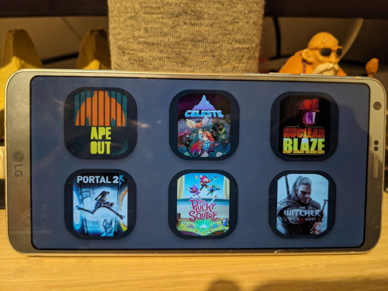

# Action for [ideckia](https://ideckia.github.io/): launch-steam-game

## Description

Launch Steam game. The action itself gets the list of your installed games. And when you select a game to launch, it gets the game image automatically from steam servers.

## Properties

| Name | Type | Description | Shared | Default | Possible values |
| ----- |----- | ----- | ----- | ----- | ----- |
| game | String | Game you want to launch | false | "" | null |

## On single click

Launches the selected game

## On long press

Does nothing

## Localizations

The localizations are stored in `loc` directory. A JSON for each locale.

## Test the action

There is a script called `test_action.js` to test the new action. Set the `props` variable in the script with the properties you want and run this command:

```
node test_action.js
```

## Example in layout file

```json
{
    "text": "launch-steam-game example",
    "bgColor": "00ff00",
    "actions": [
        {
            "name": "launch-steam-game",
            "props": {
                "game": ""
            }
        }
    ]
}
```
